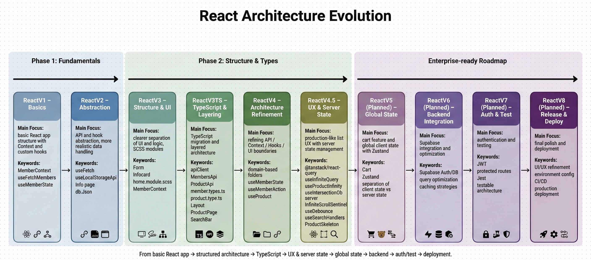

# 🗂️ React Architecture Evolution

    

> **React(JS/TS)를 실무 서비스 아키텍처로 진화시키는 기록**
> 단순 기능 구현을 넘어, 엔터프라이즈 환경에서도 통용되는 **설계와 패턴**을 연구합니다.

---

## 🏁 프로젝트 기획 동기 (Motivation)

이 프로젝트는 **프론트엔드 생태계에 대한 깊이 있는 이해**를 목표로 시작되었습니다.
초기에는 레퍼런스와 AI에 의존하여 기능을 구현했으나, 점차 코드의 품질과 유지보수성에 대한 갈증을 느끼게 되었습니다.

단순히 HTML, CSS, React 사용법을 익히는 것을 넘어, **서비스 구조, 유지보수성, 확장성** 등 실제 개발 환경에서 마주하는 설계 고민들을 직접 부딪히며 해결해보고자 합니다.

> **실무에서 통용될 수 있는 아키텍처와 설계 원칙을 스스로 학습하고 체득하는 기록**이자,
> 엔지니어로서의 문제 해결 능력과 가치를 높이기 위한 프로젝트입니다.

---

## 📌 프로젝트 개요

- **목적:** React 아키텍처를 V1부터 V8까지 **단계적으로 진화**시키며 학습
- **출발점:** 실제 엔터프라이즈 환경에서 이론적 지식을 어떻게 설계와 구현에 적용할 수 있을까?
- **핵심 목표:**
  - **확장성 (Scalability):** 규모가 커져도 유지보수 가능한 폴더 구조
  - **추상화 (Abstraction):** API Layer 및 Custom Hooks 분리를 통한 로직 캡슐화
  - **최적화 (Performance):** 렌더링 최적화 및 서버 상태 캐싱 전략
  - **UX 패턴 (User Experience):** Infinite Scroll, Debounce, Skeleton UI 등

---

## 📊 아키텍처 진화 흐름 (Roadmap)

<div align="center">
  
</div>

---

## 📂 디렉토리 구조

```bash
React-Architecture-Evolution
├── ReactV1/          # 기본 아키텍처
├── ReactV2/          # 추상화 및 전역 상태
├── ReactV3/          # REST API 및 UI 분리
├── ReactV3TS/        # TypeScript 마이그레이션
├── ReactV4/          # 아키텍처 정제
├── ReactV4.5/        # UX 패턴 및 서버 상태 (Current)
└── README.md`

```

---

## 🔍 버전별 요약

| **버전** | **핵심 변화**   | **특징**                                     | **리소스 (Log & Code)**                                                                                                                                                                                                                                                                                                                             |
| -------- | --------------- | -------------------------------------------- | --------------------------------------------------------------------------------------------------------------------------------------------------------------------------------------------------------------------------------------------------------------------------------------------------------------------------------------------------- |
| **V1**   | **기본기**      | 모듈식 아키텍처 설계 및 CRUD 구조            | [Velog](https://velog.io/@yun0-0514/React.js-%EC%BB%A4%EC%8A%A4%ED%85%80-%ED%9B%85%EA%B3%BC-%EC%BB%A4%EC%8A%A4%ED%85%80-%ED%9B%85%EC%9D%84-%ED%99%9C%EC%9A%A9%ED%95%9C-%EB%AA%A8%EB%93%88%EC%8B%9D-%EC%95%84%ED%82%A4%ED%85%8D%EC%B2%98-%EC%84%A4%EA%B3%84) / [GitHub](https://github.com/yun0-0514/React-architecture-evolution/tree/main/ReactV1) |
| **V2**   | **추상화**      | Reducer 기반 전역 관리 및 훅 추상화          | [Velog](https://velog.io/@yun0-0514/React.js-React-V1%EC%9D%98-%ED%95%9C%EA%B3%84%EB%A5%BC-%EA%B7%B9%EB%B3%B5%ED%95%98%EA%B8%B0-%EC%9C%84%ED%95%9C-%EC%83%88%EB%A1%9C%EC%9A%B4-%EB%A6%AC%ED%8C%A9%ED%86%A0%EB%A7%81-%EB%AA%A8%EB%8D%B8-React-V2) / [GitHub](https://github.com/yun0-0514/React-architecture-evolution/tree/main/ReactV2)            |
| **V3**   | **구조화**      | JSON Server 도입, RESTful API 설계           | [Velog](https://velog.io/@yun0-0514/React.js-ReactV3-%EB%A6%AC%ED%8C%A9%ED%86%A0%EB%A7%81-json-server-%EB%8F%84%EC%9E%85%EA%B3%BC-%EC%8B%A4%EB%AC%B4%ED%98%95-CRUD-%EC%95%84%ED%82%A4%ED%85%8D%EC%B2%98-%EC%99%84%EC%84%B1) / [GitHub](https://github.com/yun0-0514/React-architecture-evolution/tree/main/ReactV3)                                 |
| **V3TS** | **타입 안정성** | TypeScript 전환, API Layer 분리, 도메인 타입 | [Velog](https://velog.io/@yun0-0514/React.jsJS-to-TS-%EB%A6%AC%ED%8C%A9%ED%86%A0%EB%A7%81%EA%B3%B5%ED%8F%AC%EC%9D%98-%EB%B9%A8%EA%B0%84%EC%A4%84-ReactV3TS) / [GitHub](https://github.com/yun0-0514/React-architecture-evolution/tree/main/ReactV3TS)                                                                                               |
| **V4**   | **설계 정제**   | Hook 패턴 최적화, 도메인 확장, 검색 구현     | [Velog](https://velog.io/@yun0-0514/React.js-ReactV3-%EB%A6%AC%ED%8C%A9%ED%86%A0%EB%A7%81-json-server-%EB%8F%84%EC%9E%85%EA%B3%BC-%EC%8B%A4%EB%AC%B4%ED%98%95-CRUD-%EC%95%84%ED%82%A4%ED%85%8D%EC%B2%98-%EC%99%84%EC%84%B1) / [GitHub](https://github.com/yun0-0514/React-architecture-evolution/tree/main/ReactV4)                                 |
| **V4.5** | **UX & Async**  | React Query, Infinite Scroll, Debounce       | [Velog](https://velog.io/@yun0-0514/ReactTs-React-Query%EC%99%80-Debounce%EC%9D%98-%EB%8F%84%EC%9E%85%EC%9D%84-%ED%86%B5%ED%95%9C-%EC%8A%A4%EB%A7%88%ED%8A%B8%ED%95%9C-%EA%B2%80%EC%83%89-%EC%B5%9C%EC%A0%81%ED%99%94ReactV4.5) / [GitHub](https://github.com/yun0-0514/React-architecture-evolution/tree/main/ReactV4.5)                           |

## Future Roadmap

현재 V4.5까지 구축된 아키텍처를 기반으로, 실제 상용 서비스 수준의 기능을 단계적으로 도입할 예정입니다.

| 버전   | 주제 (Theme)       | 주요 구현 계획 (Features)          | 설계 및 학습 목표 (Goals)                                              |
| :----- | :----------------- | :--------------------------------- | :--------------------------------------------------------------------- |
| **V5** | **전역 상태 관리** | 장바구니 기능, **Zustand** 도입    | React Query(Server)와 Zustand(Client)의 명확한 상태 분리 패턴 정립     |
| **V6** | **백엔드 통합**    | **Supabase** 연동, DB 설계         | Mock API를 넘어선 실제 DB 연동, RLS 보안 설정 및 쿼리 최적화           |
| **V7** | **인증 & 테스트**  | **JWT** 로그인, **Jest** / **RTL** | 인증 가드(Protected Route) 구현 및 비즈니스 로직 단위 테스트 환경 구축 |
| **V8** | **배포 & 운영**    | **CI/CD**, 프로덕션 빌드 최적화    | 배포 자동화 및 성능 튜닝                                               |

---

## ⚡ 실행 방법 (How to Run)

각 버전은 독립된 프로젝트로 구성되어 있습니다.

```Bash

# 레포지토리 클론
git clone https://github.com/yun0-0514/React-architecture-evolution.git

# 원하는 버전으로 이동 (예: ReactV4.5)
cd ReactV4.5

# 의존성 설치 및 실행
npm install
npm run server  # Json-server API 실행
npm run dev     # 개발 서버 실행`
```

---

### 🔗 Export

[](https://github.com/ed-capstone-design/react-front)
[](https://velog.io/@yun0-0514/series/React-%EC%84%9C%EB%B9%84%EC%8A%A4-%EC%84%A4%EA%B3%84%EC%99%80-%EB%A6%AC%ED%8C%A9%ED%86%A0%EB%A7%81-%EA%B8%B0%EB%A1%9D)
[](mailto:ypy2141@naver.com)
