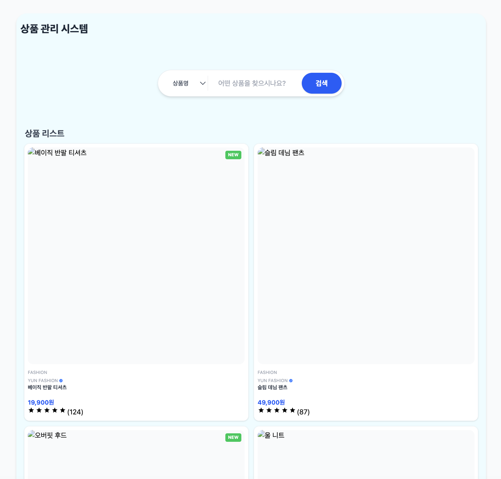

# 🚢 React V4 — 타입 기반 도메인 확장 & URL 선언적 검색

> **"상태는 UI가 아니라 URL에, 타입은 코드가 아닌 설계도에 둡니다."**
> React V4는 V3TS에서 확보한 타입 안전성을 기반으로, **대규모 상품 도메인으로의 확장**과 **URL 기반의 선언적 검색 패턴**을 엔지니어링 관점에서 구현했습니다.

---

## 🎯 V4 핵심 목표 (Goals)

1. **URL as Single Source of Truth (SSOT)**
   - 기존 UI state 중심(useState) 필터링 제거
     → **URL Query Parameter 기반** 상태 관리

   - 새로고침, 뒤로 가기, 공유(Deep Linking) 시에도 **동일한 UI 상태 보장**

2. **도메인 모델 계층화 (Domain Layering)**
   - Member 중심 구조 → Product 도메인 확장
   - 데이터의 **‘무게’**에 따라 타입 분리:
     `Meta`(검색용) → `Card`(목록용) → `Detail`(상세용)
   - 불필요한 데이터 의존성 제거 → 유지보수/확장 용이

3. **선언적 데이터 페칭 (Declarative Fetching)**
   - 명령형 `useEffect` 제거 → URL 변화가 곧 데이터 갱신
   - 단방향 흐름: `URL → Hook → UI`

4. **Async State 정규화**
   - `useFetch` 훅을 통해 로딩/에러/성공 상태 통일
   - 비동기 흐름 예측 가능 → 재사용성과 확장성 확보

---

## 🛠 아키텍처 및 설계 (Architecture & Design)

### 1️⃣ URL 기반 선언적 검색


```ts
export interface ProductSearchCondition {
  filterType: keyof Omit<ProductMeta, "id">; // id 제외, 검색 가능한 필드만 허용
  keyword: string;
}
```

- 상태 위임: **URL Query String**에 검색 상태 저장
- 단방향 흐름: `User Input → URL Update → useProduct Hook → Data Fetch → UI`
- 이점: 상태 동기화 로직 제거, SEO/공유 친화적 구조

---

### 2️⃣ 도메인 타입 계층화


```ts
// Level 1. 검색/필터용 최소 메타 데이터
interface ProductMeta {
  id: number;
  name: string;
  company: string;
  category: ProductCategory;
}

// Level 2. 목록(Card) 렌더링용 요약 정보
interface Product extends ProductMeta {
  price: number;
  thumbnailUrl: string;
  isSoldOut: boolean;
  isNew: boolean;
  reviewCount: number;
  rating: number;
}

// Level 3. 상세 페이지용 전체 데이터
interface ProductDetail extends Product {
  descriptionImages: string[];
  stock: number;
  sellerInfo?: { name: string; contact: string };
}
```

- UI 목적에 맞는 최소 데이터 사용 → 불필요 의존 제거
- 타입 설계 자체가 **확장/변경 가능성을 예측**하게 함

---

### 3️⃣ Container-Presenter 패턴

```ts
const ProductPage = () => {
  const { products, isLoading } = useProduct(); // URL 기반 검색 결과
  return <ProductList data={products} loading={isLoading} />;
};
```

- **Container:** URL 파싱 + 데이터 fetch 담당 (비즈니스 로직)
- **Presenter:** 데이터 받아서 그리기만 하는 순수 UI
- SearchBar는 **URL 변경만 담당**, 데이터 직접 요청 없음

---

### 4️⃣ 반응형 카드 UI



- CSS Grid 기반 반응형 레이아웃
- `ProductMeta` 타입 기준으로 설계 → 도메인 재사용 가능
- 모바일/태블릿/데스크톱 모두 자연스러운 UI

---

## 📌 주요 기능

- **회원(Member):** 목록 조회, 선택, 상세 보기 (최소 구현)
- **상품(Product):** 목록, 카드 UI, URL 기반 검색/필터
- **검색 흐름:** SearchBar → URL → 훅 → useFetch → UI
- **UI/UX:** 반응형 카드 레이아웃

---

## 🗺 V1 ~ V4 진화

| **버전**  | **핵심 변화**     | **아키텍처 특징**                                                         |
| --------- | ----------------- | ------------------------------------------------------------------------- |
| **V1/V2** | 기능 구현 중심    | 단순 컴포넌트, Props Drilling, Context API                                |
| **V3**    | 데이터 통신 분리  | JSON-Server, REST API 패턴                                                |
| **V3TS**  | 타입 안전성 확보  | TypeScript 도입, 제네릭 기반 AsyncState<T> 설계                           |
| **V4**    | 엔지니어링 고도화 | URL as State, 도메인 계층화, 선언적 검색 패턴, Container-Presenter 정교화 |

---

## 🔗 Export

- 📝 [Velog 포스트](https://velog.io/@yun0-0514/ReactTS-ReactV4-%EB%8F%84%EB%A9%94%EC%9D%B8-%ED%99%95%EC%9E%A5%EA%B3%BC-URL-%EA%B8%B0%EB%B0%98%EC%9D%98-%EC%84%A0%EC%96%B8%EC%A0%81-%EA%B2%80%EC%83%89-%EC%8B%9C%EC%8A%A4%ED%85%9C-%EA%B5%AC%EC%B6%95)
- 📧 [Contact: ypy2141@naver.com](mailto:ypy2141@naver.com)
